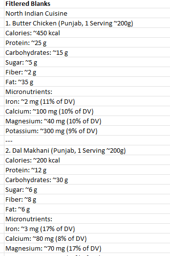

# Introduction 
This project represent a dynamic dashboard that tells the food nutrition value of different Indian cuisines. Dashboard Is mainly divided into two parts. The upper part of dashboard mainly have regional dishes along with their nutrition values. And the lower part have common dishes that is found in almost every part of India.

## Here is the dashboard file:- [Indian_food_nutrients](Indian_food_nutrients.xlsx)
# Dashboard 

- Dashboard has 90 plus different dishes
- Dishes are seprated into two parts.
  1. has regional dishes from north India to south India.
  2. has most common Indian dishes.
- Represent a dynamic view.
- Tells you daily need of a nutrient and how much a perticular dish fullfill that need.

# Excel skills used
- **Dynamic charts**
- **Data validation**
- **Formulas and Functions**
# Dataset 
Data is collected from chatgpt. Dataset has dish name along with the nutrients that it contains.
 
 

 
The dataset had everything in string format so I had to use verious type to text, filter and conditional formulas just to get numarical values of the nutrition from the dataset.
Along with it the numarical values of the nutrition should also has to be with right dish.
  
# Sorting
The next step from the data set was sorting string values of each nutrient along with the dish name and create a table. The tabel should have each dish along with every nutrients that is present in the data if there is no mention of any perticular nutrients that should also be mention in the table.
Therefore I had to make a separate table for each nutrient that is present in the data set.
 

In this table there is dish name along with a micronutrient. If a dish have no mention of that micronutrient the dataset also show that.
 

# Final Table 
After getting all the nutrients along with the dishes name I combine all of them in a single table. So that, I can make the dynamic charts from it.

The tabel has all the nutrients,their daily need, and quantity per serving.
# Charts
From the table made sutable charts that not only tells nutrients value but also compare it with daily need.

 
Charts are made combining two charts in a single chart for better visual understanding.

# Conclusion 
The deshboard can assist in finding and understand the nutrient value a dish contain and by consuming it how much daily need of that nutrient a person can fulfill.

